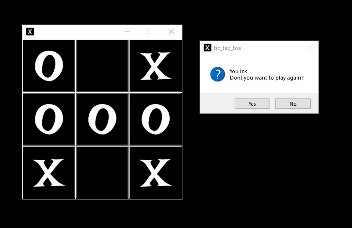

Tic-Tac-Toe Game

A simple tic-tac-toe game with a graphical interface in Python.

Requirements ❗
Python 3.x
tkinter (usually included in the standard Python distribution)
Pillow (PIL)

✅ bashpip install Pillow

Launch
bashpython run.py
Features

Play against the computer
Selecting the first move (crosses or zeros)
Smart AI with priority moves
Restart option games

🕹 Controls

🎉 Start the game

Choose whether you want to play first
Click on the cells to make moves
After finishing the game, you can start over