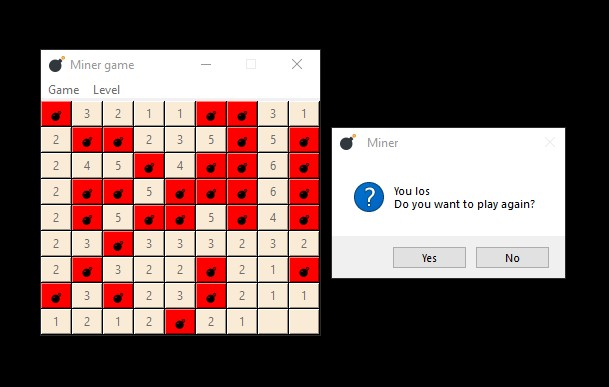

# Minesweeper Game 💣



Classic Minesweeper game with a graphical interface in Python. 👍

Requirements ❗

- Python 3.x
- tkinter (included in the standard Python package)

Files


✅Launch

```bash
python run.py
```

✅ Difficulty levels

- **Easy**: 9x9 field, 30 min
- **Medium**: 15x15 field, 50 min
- **Hard**: 18x18 field, 80 min

✅ Controls

- **Left click** - open a cell
- **Right click** - check/uncheck 🚩
- **Game menu** - new game or exit
- **Level menu** - difficulty selection

✅ Objective of the game

Open all cells without stepping on a mine. The numbers show the number of mines in adjacent cells.