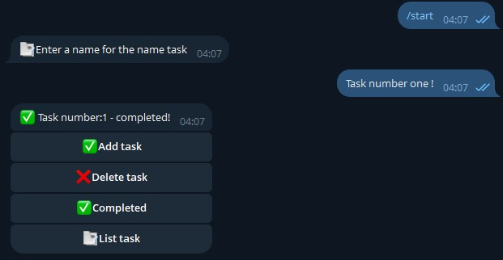

A simple Telegram bot for managing tasks (todo list) based on [aiogram](https://github.com/aiogram/aiogram).


## Features

✅- Add tasks
✅- View all tasks
✅- Mark tasks as completed
❌- Delete tasks
- Store data in a local SQLite database

## Quick Start

1. **Clone the repository:**
```bash
git clone https://github.com/VadymCov/aiogram-simple-bot-todolist.git
cd aiogram-simple-bot-todolist
```

2. **Install dependencies:**
```bash
pip install -r requirements.txt
```
> If there is no requirements.txt file, install it manually:
> ```
> pip install aiogram
> ```

3. **Create a `config.py` file with your bot token:**
```python
YOUR_TOKEN = "ваш_telegram_bot_token"
```

4. **Start the bot:**
```bash
python bot.py
```

## Usage

- Type `/start` to your bot to open the main menu.
- Use the buttons to add, view, delete and complete tasks.

## Notes

- All data is stored locally in the `user_todo_db` file (SQLite).
- The `config.py` file is added to `.gitignore` for security.

## License